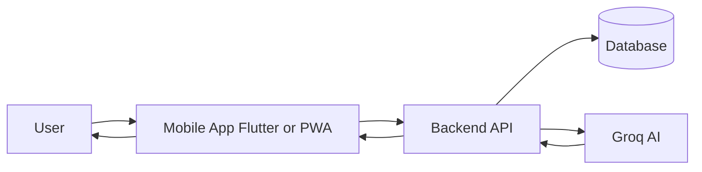

# Smart-Jothidam — Project Document

**Traditional Tamil Astrology with Modern AI**  
*One app for personalized joshiyam, daily guidance, and meaningful days — without fake practitioners.*

---

## 1. Problem Statement

### Trust issue
In Tamil Nadu, Kerala, and among the Tamil/Kerala diaspora, people deeply trust joshiyam (Tamil astrology). However, many fake practitioners have started offering joshiyam services, charge money, and give non-personalized or misleading advice. Users cannot easily verify calculations or get consistent, daily guidance in one place.

### Pain points
- No single, trustworthy place for **daily good/bad** and personalized predictions.
- No **verified, calculation-based** joshiyam that users can cross-check (e.g. Rasi, Nakshatra).
- Users either pay unreliable people or get generic, non-personalized content.
- Lack of **meaningful daily guidance** (career, health, love, remedies) in one app.

---

## 2. Solution Statement

**Smart-Jothidam** solves this by providing:

| Capability | Description |
|------------|-------------|
| **One-time user details** | User enters birth data, place, and language once; data is stored and reused for all features. |
| **Every day** | Daily horoscope and do's & don'ts based on Rasi and calculations — what’s good or bad each day. |
| **All joshiyam in one app** | Single-person chart (20 categories), couple compatibility (25 categories), daily horoscope (14 categories), Tamil calendar, calculator, and AI chat — so the person gets a **meaningful day** and personalized guidance. |
| **AI chat** | Follow-up questions on results and general joshiyam Q&A; optional conversational AI for deeper guidance. |
| **Transparent calculations** | Lahiri ayanamsa, local astrology math; Rasi, Nakshatra, Lagnam shown so users can verify. No “fake joshiyam” — data-driven, not random. |

### Monetization
- **Free version first:** Basic features (daily horoscope, limited single josiyam, limited chat) to build trust and adoption.
- **Premium (little bit pay):** Ask for more details or unlock premium features: full reports, more AI chat messages, PDF export, couple josiyam, deeper remedies — to grow revenue while keeping the app accessible.

---

## 3. Team Structure

| Role | Count | Responsibility |
|------|--------|----------------|
| **Frontend & integration (Flutter)** | 1 | Mobile UI, navigation, forms, API integration, Play Store build and listing. |
| **Backend, DB & AI engineer** | 1 | Backend APIs, database (user profiles, birth data, usage), AI/Groq integration, security. |
| **Tester** | 1 | QA, regression, device matrix, Play Store compliance. |

**Note:** The current product has a web client (React) and no backend/DB. Adding backend and persistence is in scope so “initial enter details” and “every day” features work at scale and are stored securely.

---

## 4. Timeline

| Phase | Name | Duration | Description |
|-------|------|----------|-------------|
| **1** | Foundation (backend + persistence) | 4–6 weeks | Backend, DB, auth, save user details and link to sessions. Flutter integrates once APIs exist. |
| **2** | Core app on mobile | 6–8 weeks | Flutter app (or PWA/TWA) implementing modules 1–10, wired to backend. Tester joins from mid-phase. |
| **3** | Monetization & store | 2–3 weeks | Subscription/premium logic, “ask more details / little bit pay,” store listing, assets, privacy policy. |
| **4** | Launch & iterate | 2–4 weeks | Play Store submission, review, soft launch (TN/Kerala first), then expand. |

**Total to Play Store launch:** about **3.5–5 months** with the 3-member dev + 1 tester setup.

*Exact start/end dates to be filled when the project kicks off.*

---

## 5. Modules (Numbered List)

| # | Module | Description |
|---|--------|--------------|
| 1 | **User onboarding & profile** | Initial entry of user details (name, DOB, time, place, gender, language); persistence via backend. |
| 2 | **Single-person Josiyam** | Birth data → local calculation → 20 categories (Career, Business, Finance, Education, Marriage, Love, Family, Children, Health, Mental strength, Spiritual, Foreign travel, Property, Legal, Enemy, Social status, Friends, Luck, Remedies, Overall life path) + AI narrative. |
| 3 | **Couple Josiyam** | Two persons’ details → same 20 categories + 5 (Compatibility score, Emotional bond, Financial stability together, Family harmony, Long-term growth). |
| 4 | **Result & report view** | Display basic details (Rasi, Nakshatra, Lagnam, etc.) and category-wise predictions; optional PDF/export (premium). |
| 5 | **Daily horoscope** | Date + Rasi + language → daily predictions (overview, career, business, finance, health, relationships, family, education, travel, legal, lucky numbers/color/time, remedies). |
| 6 | **Daily do's and don'ts** | Rasi-based daily do's and don'ts (AI). |
| 7 | **Tamil calendar** | Calendar view, auspicious days. |
| 8 | **Calculator** | Quick astrology calculations with AI explanations. |
| 9 | **AI chat (contextual)** | On result page: ask follow-ups with chart + last N messages; personalized joshiyam. |
| 10 | **AI chat (standalone)** | General joshiyam Q&A (no birth-data context); can be limited in free tier (e.g. 5 messages/day). |
| 11 | **Auth & subscription** | Login/signup, free vs paid, “ask more details / little bit pay” for premium (full report, more chat, export). |
| 12 | **Backend & DB** | User accounts, stored birth data, usage limits, analytics for product and success metrics. |

**Total: 12 modules** (9 existing/adapted from current product + 3 new: onboarding persistence, auth/subscription, backend/DB).

---

## 6. Play Store Launch

### Listing checklist
- [ ] **Title:** e.g. “Smart Josiyam AI — Tamil Astrology & Daily Horoscope”
- [ ] **Short description** (80 chars): Tamil + English as needed
- [ ] **Long description:** Features, languages (Tamil, English, Tanglish), disclaimers
- [ ] **Screenshots:** Phone and tablet (key screens: home, single/couple josiyam, daily horoscope, chat)
- [ ] **Feature graphic:** 1024 x 500
- [ ] **Privacy policy URL:** Live URL before submission

### Compliance
- **Privacy policy:** Clearly state data collected (birth details, usage, optional account data).
- **Predictions:** No “guaranteed” or misleading claims; use “for entertainment / guidance” and show calculation basis (Rasi, Nakshatra).
- **Age rating:** Likely 3+ or 7+ (no adult content).

### Regions
- **Phase 1:** India (Tamil Nadu, Kerala, rest of India).
- **Phase 2:** Expand to diaspora (e.g. Singapore, Malaysia, UAE, Sri Lanka, others) for global reach.

---

## 7. User and Revenue Projections

*Replace X, Y, Z and ranges with your chosen targets when finalizing.*

| Horizon | User target | Revenue / profit notes |
|---------|-------------|------------------------|
| **3 months post-launch** | 5K–20K (India, TN/Kerala focus) | Free tier dominant; 2–5% premium conversion; estimate **X INR/month**. |
| **6 months** | 25K–80K (word of mouth, basic marketing) | Growth in premium; estimate **Y INR/month**. |
| **1 year** | 100K–400K (India + some diaspora) | **Z INR/month**; consider annual subscription plans. |
| **Global / long term** | 1M+ (Tamil/Kerala diaspora worldwide) | Localizations (Tamil, Malayalam, English); scale premium and ads/partnerships if desired. |

### Success rate / KPIs to track

| Area | Metrics |
|------|--------|
| **App** | Install → registration rate; DAU/MAU; retention (D1, D7, D30). |
| **Monetization** | Free → premium conversion %; ARPU (average revenue per user). |
| **Engagement** | Single/couple/daily/chat usage; “meaningful day” (e.g. daily horoscope opens per user per week). |
| **Trust** | No “fake joshiyam” complaints; clear disclaimers; calculation transparency (show Rasi/Nakshatra so users can verify). |

---

## 8. Architecture (High Level)

- **User** enters details and uses daily horoscope, josiyam, chat.
- **Mobile app** (Flutter or React PWA/TWA) talks to **Backend API**.
- **Backend** stores/retrieves **user profiles and birth data** in **DB**, and calls **Groq AI** for predictions and chat.
- **Astrology calculations** can run on backend or client (current product uses client-side math; can be moved for consistency and security).

---

## 9. Risks and Mitigation

| Risk | Mitigation |
|------|------------|
| **Groq API availability / cost** | Monitor usage and cost; consider caching for common queries; fallback or rate limits for free tier. |
| **Chat content / safety** | System prompts to keep responses within joshiyam/guidance; optional moderation or flagging for inappropriate use. |
| **Data privacy** | Store birth data and PII only with consent; encrypt at rest and in transit; clear privacy policy and minimal data collection. |
| **Store rejection** | Avoid “guaranteed predictions”; age rating and privacy policy in place; follow store guidelines on subscriptions and in-app purchases. |

---

## Document control

| Version | Date | Changes |
|---------|------|---------|
| 1.0 | *(fill)* | Initial project document. |

*Replace X, Y, Z in Section 7 with your chosen revenue estimates. Confirm Flutter vs React PWA/TWA for mobile to lock timeline and scope.*
